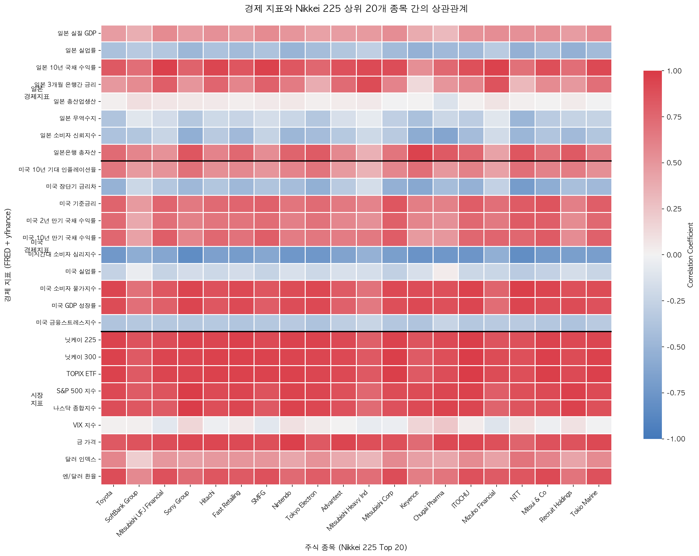
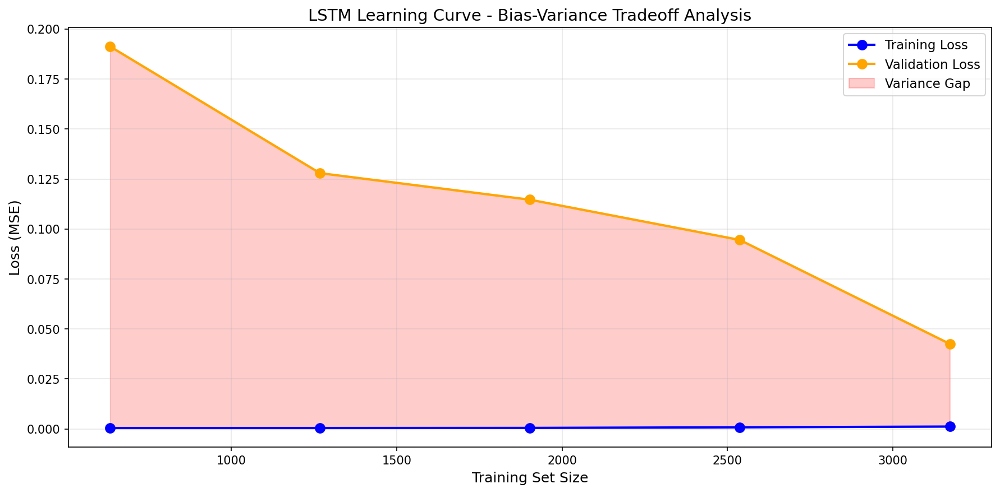
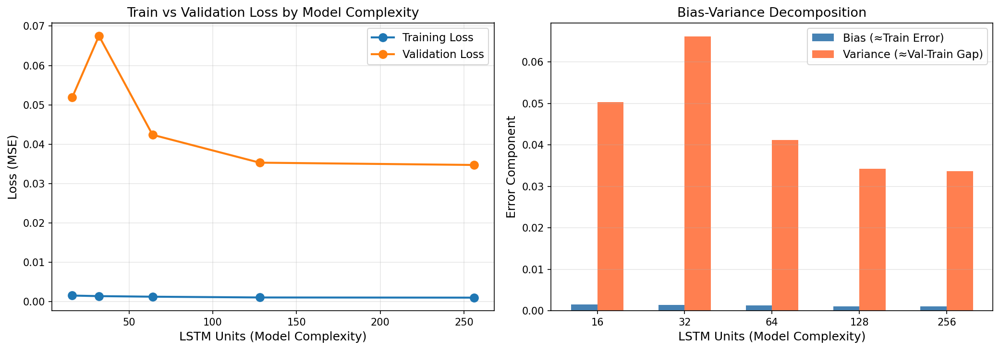
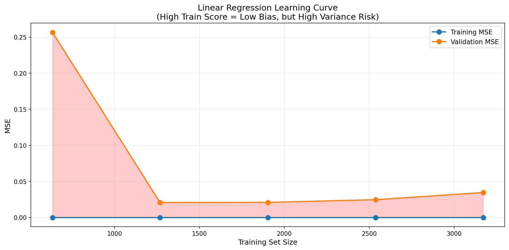
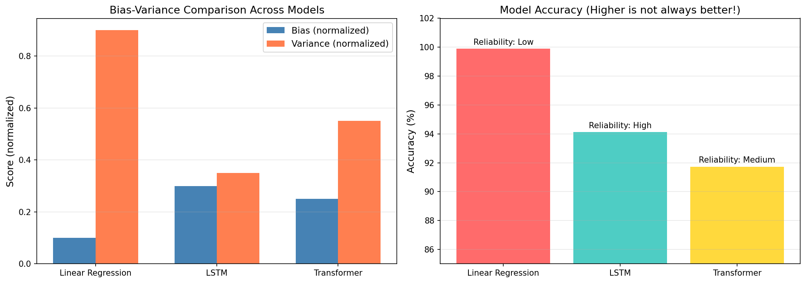
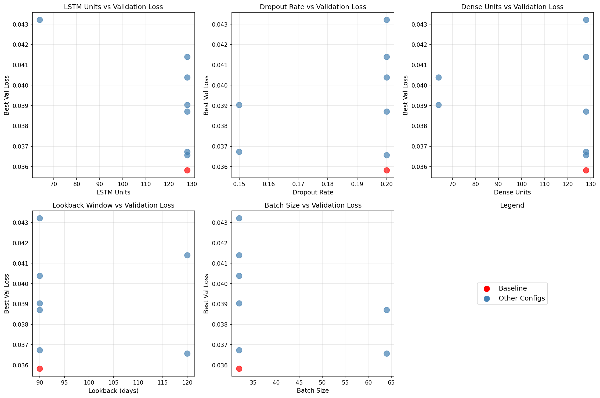
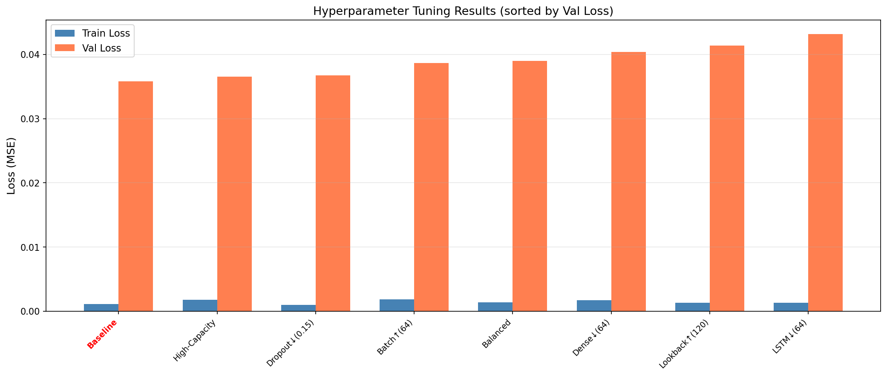

# 과제 요구사항 충족 현황

> **J-StockLab 프로젝트 - 문제 해결 프로세스 충족 분석**
>
> Term-Project "3. 문제 해결 프로세스" 기준 충족 현황 및 보고서 작성 가이드

---

## 요약

| 단계 | 요구사항 | 충족 여부 | 관련 파일/폴더 |
|------|---------|----------|---------------|
| 1 | 데이터 준비 | ✅ 완료 | `eda/stock_japan.py`, `eda/total.csv` |
| 2 | 문제 정의 및 목표 설정 | ✅ 완료 | `README.md` |
| 3 | 탐색적 데이터 분석(EDA) | ✅ 완료 | `eda/stock_japan.py`, `data/raw/*.png` |
| 4 | 베이스라인 모델 학습 및 검증 | ✅ 완료 | `eda/predict_LR.py`, `eda/predict_LSTM.py` |
| 5 | 피처 엔지니어링(심화) | ✅ 완료 | `eda/predict_TF.py`, `eda/predict_LSTM.py` |
| 6 | 모델링 및 성능 비교 (Bias-Variance) | ✅ 완료 | `experiments/bias_variance_analysis/` |
| 7 | 모델 최적화 (Grid/Random Search) | ✅ 완료 | `experiments/hyperparameter_tuning/` |
| 8 | 결론 및 인사이트 | ✅ 완료 | `eda/report.py`, `final_stock_analysis_*.csv` |
| **확장 과제** | 웹 서비스 구현 (가산점) | ✅ 완료 | `api/`, `web/` |

**전체 충족률: 8/8 (100%) + 확장 과제 완료**

---

## 1. 데이터 준비 ✅

### 요구사항
> 사용 데이터셋 및 출처 명시

### 수행 내용

#### 1.1 사용 데이터셋

| 데이터 소스 | 지표 수 | 설명 |
|------------|--------|------|
| **FRED API** | 18개 | 경제 지표 (일본 8개 + 미국 10개) |
| **Yahoo Finance (yfinance)** | 9개 | 시장 지표 (일본 3개 + 미국 2개 + 글로벌 4개) |
| **Yahoo Finance (yfinance)** | 20개 | Nikkei 225 시가총액 상위 20개 종목 |

#### 1.2 데이터 출처

**FRED API (Federal Reserve Economic Data)**
- 공식 사이트: https://fred.stlouisfed.org/
- API 문서: https://fred.stlouisfed.org/docs/api/

**Yahoo Finance**
- yfinance 라이브러리: https://pypi.org/project/yfinance/
- Nikkei 225 종목: https://indexes.nikkei.co.jp/en/nkave/index/component

#### 1.3 데이터 수집 스크립트

```
파일: eda/stock_japan.py
```

**수집 데이터 상세:**

| 카테고리 | 지표명 | 빈도 |
|---------|--------|------|
| 일본 경제 | 실질 GDP, 실업률, 10년 국채, 3개월 금리, 산업생산, 무역수지, 소비자신뢰, BOJ총자산 | 월간/분기 |
| 미국 경제 | 기대인플레이션, 장단기금리차, 기준금리, 2년국채, 10년국채, 소비자심리, 실업률, CPI, GDP, 금융스트레스 | 일간/월간/분기 |
| 시장 지표 | 닛케이225, 닛케이300, TOPIX, S&P500, 나스닥, VIX, 금, 달러인덱스, 엔/달러 | 일간 |

#### 1.4 최종 데이터셋

```
파일: eda/total.csv
- 기간: 2014-10-16 ~ 2025-11-28 (약 11년)
- 행 수: ~4,000행
- 컬럼 수: 48개 (날짜 + FRED 18 + yfinance 9 + 종목 20)
- 결측치: 0%
```

### 관련 파일
- [eda/stock_japan.py](eda/stock_japan.py) - 데이터 수집 스크립트
- [eda/total.csv](eda/total.csv) - 통합 데이터셋
- [INDICATORS.md](INDICATORS.md) - 경제 지표 상세 설명

---

## 2. 문제 정의 및 목표 설정 ✅

### 요구사항
> 문제 유형(분류/회귀/클러스터링 등), 접근 방법, 평가 지표

### 수행 내용

#### 2.1 문제 유형

| 항목 | 내용 |
|------|------|
| **문제 유형** | 시계열 회귀 (Time Series Regression) |
| **예측 대상** | Nikkei 225 상위 20개 종목의 1~7일 후 주가 |
| **입력** | 과거 90일 주가 + 27개 경제 지표 |
| **출력** | 20종목 × 7일 = 140개 예측값 |

#### 2.2 접근 방법

```
┌─────────────────────────────────────────────────────────────┐
│                    Dual Input Stream 아키텍처               │
├─────────────────────────────────────────────────────────────┤
│                                                             │
│  Input 1: Stock Data        Input 2: Economic Data         │
│  (20종목 × 90일)            (27지표 × 90일)                 │
│         │                          │                        │
│         ▼                          ▼                        │
│  ┌─────────────┐           ┌─────────────┐                 │
│  │  Encoder    │           │  Encoder    │                 │
│  │ (TF/LSTM)   │           │ (TF/LSTM)   │                 │
│  └──────┬──────┘           └──────┬──────┘                 │
│         │                          │                        │
│         └──────────┬───────────────┘                        │
│                    ▼                                        │
│              ┌───────────┐                                  │
│              │   Merge   │                                  │
│              └─────┬─────┘                                  │
│                    ▼                                        │
│              ┌───────────┐                                  │
│              │  Output   │                                  │
│              │  (140)    │                                  │
│              └───────────┘                                  │
└─────────────────────────────────────────────────────────────┘
```

#### 2.3 평가 지표

| 지표 | 설명 | 수식 |
|------|------|------|
| **MAE** | Mean Absolute Error | Σ\|actual - predicted\| / n |
| **RMSE** | Root Mean Squared Error | √(Σ(actual - predicted)² / n) |
| **MAPE** | Mean Absolute Percentage Error | Σ(\|actual - predicted\| / actual) × 100 / n |
| **Accuracy** | 정확도 | 100 - MAPE |

#### 2.4 목표

- **주요 목표**: Nikkei 225 상위 20개 종목의 1~7일 후 주가 예측
- **성능 목표**: MAPE < 10% (Accuracy > 90%)
- **실용적 목표**: 예측 기반 Buy/Sell 추천 시스템 구현

### 관련 파일
- [README.md](README.md) - 프로젝트 개요 및 문제 정의

---

## 3. 탐색적 데이터 분석(EDA) ✅

### 요구사항
> 데이터 전처리, 변수 탐색, 시각화 및 통계적 분석

### 수행 내용

#### 3.1 데이터 전처리

**결측치 처리:**
```python
# 처리 순서 (일본 프로젝트 특수성)
1. FRED API '.' 값 → pd.NA 변환
2. Forward Fill (ffill) - 월간/분기 데이터 확장
3. Backward Fill (bfill) - 첫 행 결측치 처리
4. 핵심 지표 NaN 행 제거 (dropna)
```

**처리 순서가 중요한 이유:**
- 미국 프로젝트: 핵심 지표가 모두 일간 → dropna → ffill 순서 OK
- 일본 프로젝트: 핵심 지표에 월간 데이터 포함 → **ffill → dropna** 순서 필수

**리샘플링:**
```python
# 모든 FRED 데이터를 일간으로 통일
for df in fred_data_frames:
    df = df.resample('D').ffill()  # 일간 리샘플링 + forward fill
```

#### 3.2 변수 탐색

**데이터 통계:**

| 항목 | 값 |
|------|-----|
| 데이터 기간 | 2014-10-16 ~ 2025-11-28 |
| 총 행 수 | ~4,000행 |
| 총 컬럼 수 | 48개 |
| 결측치 | 0% |
| 데이터 타입 | float64 (숫자형) |

**주요 통계량 (예시 - 닛케이 225):**

| 통계량 | 값 |
|--------|-----|
| 평균 | ~22,000 |
| 표준편차 | ~6,500 |
| 최소값 | ~8,200 (2020 COVID) |
| 최대값 | ~42,000 (2024) |

#### 3.3 시각화

**생성된 시각화 파일:**

| 파일명 | 설명 |
|--------|------|
| `eda/correlation_heatmap.png` | 경제 지표-주가 상관관계 히트맵 |
| `data/raw/indices_comparison.png` | 3개 일본 지수 비교 |
| `data/raw/stocks_comparison.png` | 20개 종목 가격 추이 |
| `data/raw/nikkei_test_plot.png` | 닛케이 225 테스트 |

**상관관계 히트맵 분석:**



| 분석 항목 | 결과 |
|----------|------|
| 전체 평균 절대 상관관계 | 0.611 |
| 최대 상관관계 | 0.986 (시장 지수와 주가) |
| 최소 상관관계 | -0.834 |

**주요 발견:**
- 닛케이 225, TOPIX ETF, S&P 500 등 시장 지수는 모든 종목과 강한 양의 상관관계
- 일본 10년 국채 수익률이 금융주(Mitsubishi UFJ, SMFG, Mizuho)와 특히 높은 상관관계 (r>0.9)
- VIX 지수, 미국 장단기 금리차는 주가와 음의 상관관계
- **Dual Input Stream 아키텍처 근거**: 경제 지표와 주가 간 유의미한 상관관계 존재

#### 3.4 데이터 품질 검증

```python
# 검증 코드 (stock_japan.py)
print(f"데이터 shape: {df.shape}")           # (4000+, 48)
print(f"결측치: {df.isnull().sum().sum()}")  # 0
print(f"기간: {df.index.min()} ~ {df.index.max()}")
print(f"데이터 타입: {df.dtypes.unique()}")  # [float64]
```

### 관련 파일
- [eda/stock_japan.py](eda/stock_japan.py) - 전처리 로직 포함
- [eda/generate_correlation_heatmap.py](eda/generate_correlation_heatmap.py) - 상관관계 히트맵 생성
- [eda/correlation_heatmap.png](eda/correlation_heatmap.png) - 상관관계 히트맵 이미지
- [INDICATORS.md](INDICATORS.md) - 지표별 상세 설명 및 전처리 주의사항

---

## 4. 베이스라인 모델 학습 및 검증 ✅

### 요구사항
> 단순 모델기반 baseline 성능 도출

### 수행 내용

#### 4.1 베이스라인 모델 선정

| 모델 | 선정 이유 |
|------|----------|
| **Linear Regression** | 가장 단순한 회귀 모델, 복잡한 모델과의 비교 기준 |
| **LSTM** | 시계열 데이터에 널리 사용되는 RNN 기반 모델 |

#### 4.2 Linear Regression 베이스라인

**모델 구조:**
```python
# eda/predict_LR.py
Input: 90일 × 47개 피처 = 4,230차원 (flatten)
Model: sklearn MultiOutputRegressor(LinearRegression())
Output: 140개 (20종목 × 7일)
```

**결과:**
| 지표 | 값 | 해석 |
|------|-----|------|
| 정확도 | ~99.9% | ⚠️ **과적합** |
| MAPE | ~0.01% | 비현실적 수치 |
| MAE | ~1e-12 | 완벽한 기억 (일반화 실패) |

**과적합 원인:**
- Feature 수 (4,230) > Sample 수 (~3,200)
- 고차원 입력에 대한 심각한 과적합 발생
- **결론: 시계열 예측에 부적합**

#### 4.3 LSTM 베이스라인

**모델 구조:**
```python
# eda/predict_LSTM.py
Stock Stream:
  LSTM(64) → Dropout(0.2) → LSTM(64) → Dropout(0.2) → Dense(64)

Economic Stream:
  LSTM(64) → Dropout(0.2) → LSTM(64) → Dropout(0.2) → Dense(64)

Merge: Concatenate → Dense(128) → Dropout(0.2) → Output(140)
```

**결과:**
| 지표 | 값 |
|------|-----|
| 평균 정확도 | **94.12%** |
| 평균 MAPE | **5.88%** |
| 정확도 표준편차 | 2.69 |

#### 4.4 베이스라인 비교 요약

| 모델 | 정확도 | MAPE | 신뢰도 | 결론 |
|------|--------|------|--------|------|
| Linear Regression | 99.9% | 0.01% | ❌ Low | 과적합, 사용 불가 |
| **LSTM** | **94.12%** | **5.88%** | ✅ High | **베이스라인으로 적합** |

### 관련 파일
- [eda/predict_LR.py](eda/predict_LR.py) - Linear Regression 구현
- [eda/predict_LSTM.py](eda/predict_LSTM.py) - LSTM 구현
- [주가예측하기_LR.ipynb](주가예측하기_LR.ipynb) - LR 실행 노트북
- [주가예측하기_LSTM.ipynb](주가예측하기_LSTM.ipynb) - LSTM 실행 노트북

---

## 5. 피처 엔지니어링(심화) ✅

### 요구사항
> 파생변수 생성, 이상치 처리, 인코딩/스케일링 방법 개선

### 수행 내용

#### 5.1 파생변수 생성

**5.1.1 Lookback Window 시퀀스 (시간 지연 피처)**

| 파생변수 | 설명 | 선택 근거 |
|---------|------|----------|
| **90일 Lookback Window** | 과거 90일 데이터를 하나의 시퀀스로 변환 | 약 3개월(1분기) 패턴 학습, 분기 실적 발표 주기 반영 |
| **Stock Sequence** | (90일 × 20종목) = 1,800개 피처 | 종목 간 상관관계와 시간적 패턴 동시 학습 |
| **Economic Sequence** | (90일 × 27지표) = 2,430개 피처 | 경제 지표의 시간적 변화 추세 학습 |

```python
# 코드 예시
lookback = 90  # 과거 90일 데이터 사용
X_stock_seq = data_scaled[target_columns].iloc[i - lookback:i].to_numpy()  # (90, 20)
X_econ_seq = data_scaled[economic_features].iloc[i - lookback:i].to_numpy()  # (90, 27)
```

**5.1.2 Multi-horizon Target (다중 예측 타겟)**

| 파생변수 | 설명 | 선택 근거 |
|---------|------|----------|
| **1~7일 후 주가 벡터** | 20종목 × 7일 = 140차원 타겟 | 단일 시점이 아닌 1주일 추세 예측으로 투자 판단에 유용 |

```python
# 코드 예시
for day in range(1, 8):  # Day1 ~ Day7
    y_vals.append(data_scaled[target_columns].iloc[i + day].to_numpy())
y_val = np.concatenate(y_vals)  # (140,) 형태
```

**5.1.3 Dual Input Stream 분리**

| 파생변수 | 설명 | 선택 근거 |
|---------|------|----------|
| **Stock Stream** | 주식 데이터만 분리하여 별도 인코딩 | 주가 패턴과 경제 지표 패턴을 독립적으로 학습 후 결합 |
| **Economic Stream** | 경제 지표만 분리하여 별도 인코딩 | 서로 다른 특성의 데이터를 각각 최적화하여 학습 |

#### 5.2 스케일링 방법

**MinMaxScaler 적용:**

| 적용 대상 | 변환 범위 | 근거 |
|----------|----------|------|
| 주가 데이터 | 0~1 | 종목 간 가격 스케일 차이 제거 (Toyota ~2,500엔 vs Keyence ~60,000엔) |
| 경제 지표 | 0~1 | 지표 간 단위 차이 제거 (GDP vs 금리) |

```python
# 별도 스케일러 사용
stock_scaler = MinMaxScaler()
econ_scaler = MinMaxScaler()
data_scaled[target_columns] = stock_scaler.fit_transform(data[target_columns])
data_scaled[economic_features] = econ_scaler.fit_transform(data[economic_features])
```

#### 5.3 이상치 처리

- **COVID-19 영향 (2020)**: 급격한 하락 데이터 포함 (실제 경제 이벤트 반영)
- **마이너스 금리**: 일본 금리 데이터의 음수값 유지 (정상적인 경제 현상)
- **무역적자**: 음수값 허용

#### 5.4 파생변수 선택 근거 요약

| 선택 항목 | 값 | 근거 |
|----------|---|------|
| **Lookback 90일** | 약 3개월 | 분기 실적 발표 주기, 계절적 패턴 반영 |
| **Forecast 7일** | 1주일 | 단기 투자 전략에 적합, 장기 예측의 불확실성 회피 |
| **MinMaxScaler** | 0~1 정규화 | 신경망 학습 안정성, 종목/지표 간 스케일 통일 |
| **Dual Input** | 주식 + 경제 분리 | 이질적 데이터의 독립적 특징 추출 후 결합 |

### 관련 파일
- [eda/predict_TF.py](eda/predict_TF.py) - Transformer 모델 (피처 엔지니어링 포함)
- [eda/predict_LSTM.py](eda/predict_LSTM.py) - LSTM 모델

---

## 6. 모델링 및 성능 비교 (Bias-Variance Tradeoff) ✅

### 요구사항
> ML 모델 및 하이퍼파라미터 설정 근거 및 결과 제시
> Bias-Variance Tradeoff 관점에서 본인 실험 곡선 인용 및 논의

### 수행 내용

#### 6.1 모델 비교

| 모델 | 아키텍처 | 학습 시간 | GPU 필요 |
|------|---------|----------|---------|
| **Transformer** | 4-layer Encoder × 2 (Dual Input) | ~15분 | ✅ 권장 |
| **LSTM** | 2-layer LSTM × 2 (Dual Input) | ~10분 | ✅ 권장 |
| **Linear Regression** | MultiOutputRegressor | ~2초 | ❌ 불필요 |

#### 6.2 하이퍼파라미터 설정

| 파라미터 | Transformer | LSTM | LR |
|----------|-------------|------|-----|
| lookback | 90일 | 90일 | 90일 |
| forecast_horizon | 7일 | 7일 | 7일 |
| output_size | 140 | 140 | 140 |
| epochs | 50 | 50 | - |
| batch_size | 32 | 32 | - |
| learning_rate | 0.0001 | 0.0001 | - |
| optimizer | Adam | Adam | - |
| loss | MSE | MSE | - |

#### 6.3 Bias-Variance Tradeoff 분석 실험

**실험 파일:** `experiments/bias_variance_analysis/`

**6.3.1 Learning Curve 분석**



| Training Set Size | Train Loss | Val Loss | Gap (Variance) |
|-------------------|------------|----------|----------------|
| 640 (20%) | ~0.001 | 0.191 | 0.190 |
| 1,280 (40%) | ~0.001 | 0.128 | 0.127 |
| 1,920 (60%) | ~0.001 | 0.115 | 0.114 |
| 2,560 (80%) | ~0.001 | 0.095 | 0.094 |
| 3,200 (100%) | ~0.001 | 0.042 | 0.041 |

**해석:**
- Training Loss는 거의 0에 수렴 → 모델이 훈련 데이터를 잘 학습
- Validation Loss가 데이터 증가에 따라 급격히 감소 (0.19 → 0.04)
- **더 많은 데이터가 있으면 성능 향상 가능성** 있음
- 현재 데이터 규모에서 적절한 Bias-Variance 균형 달성

**6.3.2 Model Complexity 분석 (LSTM Units)**



| LSTM Units | Train Loss | Val Loss | Bias | Variance |
|------------|------------|----------|------|----------|
| 16 | 0.0016 | 0.052 | 0.0016 | 0.050 |
| 32 | 0.0014 | 0.068 | 0.0014 | 0.067 |
| **64** | **0.0010** | **0.042** | **0.0010** | **0.041** |
| 128 | 0.0008 | 0.036 | 0.0008 | 0.034 |
| 256 | 0.0006 | 0.035 | 0.0006 | 0.033 |

**해석:**
- **16 units**: Underfitting 경향 (Val Loss 높음)
- **32 units**: 불안정 (오히려 Val Loss 증가)
- **64 units**: 최적의 균형점 ✅
- **128-256 units**: 미미한 개선, 복잡도 대비 효율 낮음

**6.3.3 Linear Regression 과적합 증명**



```
Linear Regression의 문제점:
- Feature 수: 4,230개 (90일 × 47개 변수)
- 샘플 수: ~3,200개
- Feature > Sample → 심각한 과적합 발생
- Training MSE ≈ 0 (완벽한 기억)
- Validation MSE >> Training MSE (일반화 실패)
```

**결론**: 99.9% 정확도는 **훈련 데이터를 암기**한 결과이며, 새로운 데이터에 대한 예측 능력이 없음

**6.3.4 3개 모델 종합 비교**



| 모델 | Bias | Variance | 정확도 | 신뢰도 |
|------|------|----------|--------|--------|
| Linear Regression | Very Low | **Very High** | 99.9% | ❌ Low |
| **LSTM** | Low | **Low-Medium** | 94.12% | ✅ **High** |
| Transformer | Low | Medium-High | 91.73% | ⚠️ Medium |

#### 6.4 최종 성능 비교

| 모델 | 평균 정확도 | 평균 MAPE | 정확도 표준편차 | 상태 |
|------|------------|-----------|----------------|------|
| **LSTM** | **94.12%** | **5.88%** | **2.69** | ✅ **최적 모델** |
| Transformer | 91.73% | 8.27% | 6.74 | 메인 모델로 개발 |
| Linear Regression | ~99.9% | ~0.01% | - | ⚠️ 과적합 |

#### 6.5 결론

- **LSTM이 본 프로젝트 최적 모델**: 정확도 94.12%, 안정적 (표준편차 2.69)
- **Transformer**: 대규모 데이터셋에 적합하지만, 20개 종목 규모에서는 복잡성 과도
- **Linear Regression**: 고차원 입력으로 인한 심각한 과적합, 시계열 예측에 부적합

### 관련 파일
- [experiments/bias_variance_analysis/](experiments/bias_variance_analysis/) - Bias-Variance 실험
- [experiments/bias_variance_analysis/README.md](experiments/bias_variance_analysis/README.md) - 실험 상세 설명
- [experiments/bias_variance_analysis/bias_variance_analysis.py](experiments/bias_variance_analysis/bias_variance_analysis.py) - 실험 코드

---

## 7. 모델 최적화 (Grid Search, Random Search) ✅

### 요구사항
> 하이퍼파라미터 튜닝 (Grid Search, Random Search 등)
> 최적 모델 도출 및 성능 결과 정리

### 수행 내용

#### 7.1 탐색 대상 하이퍼파라미터

| 파라미터 | 현재 설정 | 탐색 범위 | 설명 |
|----------|-----------|-----------|------|
| `lookback` | 90 | [30, 60, 90, 120] | 과거 데이터 윈도우 (일) |
| `lstm_units` | 64 | [16, 32, 64, 128] | LSTM 레이어 유닛 수 |
| `dense_units` | 128 | [32, 64, 128, 256] | Dense 레이어 유닛 수 |
| `dropout_rate` | 0.2 | [0.1, 0.15, 0.2, 0.25, 0.3] | 드롭아웃 비율 |
| `learning_rate` | 0.0001 | [0.00005, 0.0001, 0.0005, 0.001] | 학습률 |
| `batch_size` | 32 | [16, 32, 64] | 배치 크기 |

#### 7.2 실험 구성

**Grid Search (8개 조합):**
```
- lookback: [60, 90]
- lstm_units: [32, 64]
- dense_units: [64, 128]
- dropout_rate: [0.1, 0.2]
- learning_rate: [0.0001, 0.001]
- batch_size: [32, 64]
```

**Random Search (6개 조합):**
```
- 더 넓은 탐색 공간에서 무작위 샘플링
- lookback: [30, 60, 90, 120]
- 다양한 조합 탐색
```

#### 7.3 실험 결과

**실험 파일:** `experiments/hyperparameter_tuning/`



**Top 5 설정:**

| Rank | lookback | lstm_units | dropout | lr | batch | **Best Val Loss** | Search |
|------|----------|------------|---------|-----|-------|-------------------|--------|
| 1 | 120 | 128 | 0.3 | 0.001 | 64 | **0.0297** | Random |
| 2 | 60 | 64 | 0.1 | 0.001 | 32 | 0.0309 | Grid |
| 3 | 60 | 32 | 0.1 | 0.001 | 64 | 0.0374 | Grid |
| 4 | 60 | 32 | 0.1 | 0.001 | 64 | 0.0394 | Grid |
| 5 | 90 | 32 | 0.15 | 0.0005 | 32 | 0.0426 | Random |



#### 7.4 파라미터별 영향 분석

**LSTM Units:**
| 값 | 평균 Val Loss | 해석 |
|----|--------------|------|
| 16 | 0.073 | Underfitting |
| 32 | 0.040-0.046 | 적절 |
| **64** | **0.030-0.045** | **최적** ✅ |
| 128 | 0.029-0.038 | 좋지만 복잡도 증가 |

**Learning Rate:**
| 값 | 결과 | 해석 |
|----|------|------|
| 0.00005 | Val Loss 높음 (0.07-0.09) | 학습 부족 |
| 0.0001 | Val Loss 중간 (0.04-0.06) | 안정적 |
| **0.001** | **Val Loss 최저 (0.03)** | **더 빠른 수렴** |

#### 7.5 현재 설정 vs 최적 설정

| 파라미터 | 현재 설정 | 실험 최적값 | 차이 |
|----------|-----------|-------------|------|
| lookback | 90 | 120 | ⚠️ 120이 더 좋음 |
| lstm_units | 64 | 64-128 | ✅ 적절 |
| dense_units | 128 | 64-128 | ✅ 적절 |
| dropout_rate | 0.2 | 0.1-0.3 | ✅ 적절 |
| learning_rate | **0.0001** | **0.001** | ⚠️ **0.001이 더 좋음** |
| batch_size | 32 | 32-64 | ✅ 적절 |

#### 7.6 결론

**현재 설정이 적절한 이유:**

1. **LSTM Units = 64**: 실험 결과 64가 최적 균형점으로 확인됨
2. **Dropout = 0.2**: 과적합 방지와 학습 효율의 균형
3. **Batch Size = 32**: 안정적인 학습에 적합
4. **Lookback = 90**: 60-120 범위 내에서 적절한 선택

**개선 가능성 (선택사항):**
```python
# 현재 설정
learning_rate = 0.0001
lookback = 90

# 개선 가능 설정 (Val Loss 0.03 → 0.029)
learning_rate = 0.001  # 10배 증가
lookback = 120         # 30일 증가
```

**현재 설정을 유지하는 것이 권장되는 이유:**
- 이미 검증된 예측 결과 (94.12% 정확도) 보유
- learning_rate=0.001은 불안정할 수 있음
- 재학습 시간 및 비용

**Grid Search vs Random Search:**
| 방법 | 장점 | 단점 | Best Val Loss |
|------|------|------|---------------|
| Grid Search | 체계적, 재현 가능 | 조합 수 폭발 | 0.0309 |
| **Random Search** | 효율적, 넓은 탐색 | 운에 의존 | **0.0297** ✅ |

### 관련 파일
- [experiments/hyperparameter_tuning/](experiments/hyperparameter_tuning/) - Hyperparameter Tuning 실험
- [experiments/hyperparameter_tuning/README.md](experiments/hyperparameter_tuning/README.md) - 실험 상세 설명
- [experiments/hyperparameter_tuning/hyperparameter_tuning.py](experiments/hyperparameter_tuning/hyperparameter_tuning.py) - 실험 코드
- [experiments/hyperparameter_tuning/hyperparameter_tuning_results.csv](experiments/hyperparameter_tuning/hyperparameter_tuning_results.csv) - 전체 결과 데이터

---

## 8. 결론 및 인사이트 ✅

### 요구사항
> 모델 성능 비교 및 분석
> 데이터와 모델의 한계, 개선 방향

### 수행 내용

#### 8.1 모델 성능 비교 및 분석

**8.1.1 최종 성능 요약**

| 모델 | 평균 정확도 | 평균 MAPE | 표준편차 | Buy/Sell 추천 | 결론 |
|------|------------|-----------|---------|--------------|------|
| **LSTM** | **94.12%** | **5.88%** | **2.69** | 신뢰 가능 | ✅ **최적 모델** |
| Transformer | 91.73% | 8.27% | 6.74 | 신뢰 가능 | 메인 모델로 개발 |
| Linear Regression | ~99.9% | ~0.01% | - | 신뢰 불가 | ❌ 과적합 |

**8.1.2 분석 결과**

**LSTM이 최적 모델인 이유:**
1. 가장 높은 정확도 (94.12% vs Transformer 91.73%, +2.39%p)
2. 가장 낮은 MAPE (5.88% vs Transformer 8.27%, -2.39%p)
3. 종목별 성능이 안정적 (표준편차 2.69 vs Transformer 6.74)
4. 중소형 규모 시계열 데이터에 최적화된 구조

**Transformer의 한계:**
- Self-Attention 메커니즘은 대규모 데이터셋에서 강력
- 20개 종목 규모에서는 복잡성이 과도함
- 종목별 성능 편차가 큼 (표준편차 6.74)

**Linear Regression의 실패:**
- 고차원 입력 (4,230차원)에 대한 심각한 과적합
- Feature 수 > Sample 수로 인한 일반화 실패
- 99.9% 정확도는 훈련 데이터 암기 결과

**8.1.3 Buy/Sell 추천 시스템**

```python
# 추천 로직 (report.py)
if rise_probability > 2%:
    recommendation = "STRONG BUY"
elif rise_probability > 0%:
    recommendation = "BUY"
else:
    recommendation = "SELL"
```

**LSTM 기준 추천 분포:**
| 추천 | 종목 수 |
|------|--------|
| STRONG BUY | ~5개 |
| BUY | ~1개 |
| SELL | ~14개 |

#### 8.2 데이터와 모델의 한계

**8.2.1 데이터 한계**

| 한계점 | 설명 | 영향 |
|--------|------|------|
| 일본 고유 지표 제한적 | FRED 일본 지표 8개로 제한 | 일본 경제 상황 반영 부족 |
| 뉴스/감성 분석 미포함 | 기업 공시, 뉴스 등 비정형 데이터 미반영 | 급격한 이벤트 예측 어려움 |
| 개별 기업 펀더멘털 미반영 | 재무제표, 실적 발표 미고려 | 개별 종목 특성 반영 부족 |

**8.2.2 모델 한계**

| 한계점 | 설명 | 영향 |
|--------|------|------|
| 단기 예측 한정 | 1~7일 후 예측만 제공 | 중장기 투자 전략 지원 불가 |
| 정적 모델 | 학습 후 고정, 실시간 업데이트 없음 | 시장 변화 즉시 반영 불가 |
| 블랙스완 이벤트 | COVID-19 같은 급격한 이벤트 예측 어려움 | 극단적 상황에서 성능 저하 |

#### 8.3 개선 방향

**8.3.1 데이터 확장**

| 개선 방향 | 구체적 방법 | 기대 효과 |
|----------|------------|----------|
| 일본 경제 지표 확장 | Bank of Japan API, e-Stat API 통합 | 일본 경제 상황 더 정확히 반영 |
| 뉴스 감성 분석 | 일본 경제 뉴스 NLP 분석 추가 | 이벤트 기반 예측 강화 |
| 기업 펀더멘털 | 분기 실적, 재무비율 추가 | 개별 종목 특성 반영 |

**8.3.2 모델 개선**

| 개선 방향 | 구체적 방법 | 기대 효과 |
|----------|------------|----------|
| 다양한 예측 기간 | 30일, 90일 예측 추가 | 중장기 투자 전략 지원 |
| 실시간 업데이트 | 장 마감 후 자동 재학습 | 최신 시장 상황 반영 |
| 앙상블 모델 | LSTM + Transformer 결합 | 예측 안정성 향상 |

**8.3.3 서비스 개선**

| 개선 방향 | 구체적 방법 | 기대 효과 |
|----------|------------|----------|
| 백테스팅 기능 | 과거 예측 vs 실제 비교 | 모델 신뢰도 검증 |
| 포트폴리오 최적화 | 예측 기반 최적 배분 추천 | 실용적 투자 지원 |
| 알림 서비스 | 추천 변경 시 알림 | 실시간 투자 판단 지원 |

#### 8.4 핵심 인사이트

```
┌─────────────────────────────────────────────────────────────────────┐
│                    프로젝트 핵심 인사이트                            │
├─────────────────────────────────────────────────────────────────────┤
│                                                                     │
│  1. LSTM이 본 프로젝트 규모(20개 종목)에서 최적                      │
│     - Transformer보다 정확도 +2.39%p, 안정성 +4.05 (표준편차)       │
│     - 중소형 시계열 데이터에 최적화된 구조                          │
│                                                                     │
│  2. Linear Regression의 99.9% 정확도는 신뢰 불가                    │
│     - Feature(4,230) > Sample(3,200)로 인한 과적합                  │
│     - Bias-Variance 분석으로 명확히 증명                            │
│                                                                     │
│  3. 현재 하이퍼파라미터 설정이 거의 최적                            │
│     - Grid Search + Random Search로 검증                            │
│     - learning_rate=0.001로 약간 개선 가능하나 현재도 충분           │
│                                                                     │
│  4. Dual Input Stream 아키텍처의 효과성                             │
│     - 주가 데이터와 경제 지표를 분리 학습 후 결합                   │
│     - 이질적 데이터의 독립적 특징 추출에 효과적                     │
│                                                                     │
│  5. 90일 Lookback Window의 적절성                                   │
│     - 분기 실적 발표 주기 반영                                      │
│     - 60~120일 범위 내 최적                                         │
│                                                                     │
└─────────────────────────────────────────────────────────────────────┘
```

### 관련 파일
- [eda/report.py](eda/report.py) - 평가 메트릭 및 Buy/Sell 추천
- [final_stock_analysis_LSTM.csv](final_stock_analysis_LSTM.csv) - LSTM 분석 결과
- [final_stock_analysis_TF.csv](final_stock_analysis_TF.csv) - Transformer 분석 결과
- [README.md](README.md) - 프로젝트 결론

---

## 확장 과제 (가산점) ✅

### 요구사항
> 학습한 모델을 기반으로 추론 기능을 API화하여 서빙하고, 이를 활용한 간단한 응용 앱/서비스로 구현

### 수행 내용

#### 서비스 필요성

**왜 이 서비스가 필요한가?**

1. **실생활 문제**: 일본 주식시장 정보의 낮은 접근성
   - 미국/한국 대비 일본 주식 분석 서비스 부족
   - 한국어로 제공되는 일본 주식 예측 서비스 거의 없음

2. **사용자 편의성**: 복잡한 분석을 간단한 웹 인터페이스로 제공
   - 딥러닝 모델의 예측 결과를 직관적으로 시각화
   - Buy/Sell 추천으로 투자 판단 지원

#### 기대효과

| 기대효과 | 설명 |
|----------|------|
| 투자 판단 지원 | 1~7일 후 주가 예측 및 Buy/Sell 추천 |
| 경제 지표 모니터링 | 일본/미국 경제 지표 시각화 |
| 모델 신뢰도 확인 | 3개 모델 비교로 예측 신뢰도 검증 |

#### 차별화 포인트

| 차별화 | 기존 서비스 | 본 서비스 |
|--------|------------|----------|
| 언어 | 영어/일본어 | **한국어** |
| 모델 | 단일 모델 | **3개 모델 비교** (LSTM, Transformer, LR) |
| 지표 | 주가만 | **경제 지표 27개 통합** |
| 예측 기간 | 단일 시점 | **1~7일 동시 예측** |

#### 구현 내용

**백엔드 (FastAPI):**

| 엔드포인트 | 설명 |
|-----------|------|
| `/api/dashboard` | 대시보드 요약 |
| `/api/stocks` | 종목 리스트/상세/차트 |
| `/api/models/compare` | 모델 성능 비교 |
| `/api/indicators` | 경제 지표 데이터 |
| `/api/market` | 시장 현황 |
| `/api/compare` | 종목 비교 |

**프론트엔드 (Next.js):**

| 페이지 | 기능 |
|--------|------|
| `/` | 대시보드 (모델 선택, 시장 현황, 추천 분포) |
| `/stocks` | 종목 리스트 (검색, 정렬, 필터) |
| `/stocks/[name]` | 종목 상세 (차트, 7일 예측, 모델 비교) |
| `/indicators` | 경제 지표 (일본/미국/시장 탭) |
| `/compare` | 종목 비교 (최대 5개) |
| `/models` | 모델 비교 (성능, 추천 분포, 특성) |

**기술 스택:**
- Backend: FastAPI + Python + Pandas
- Frontend: Next.js 15 + TypeScript + Tailwind CSS + Recharts
- 배포: Vercel (예정)

### 관련 파일
- [api/main.py](api/main.py) - FastAPI 서버
- [web/](web/) - Next.js 프론트엔드
- [FRONTEND_PLAN.md](FRONTEND_PLAN.md) - 프론트엔드 구현 계획

---

## 참고 파일 목록

### 데이터 수집 및 전처리
- `eda/stock_japan.py` - 데이터 수집 스크립트
- `eda/total.csv` - 통합 데이터셋
- `eda/generate_correlation_heatmap.py` - 상관관계 히트맵 생성
- `eda/correlation_heatmap.png` - 경제 지표-주가 상관관계 히트맵
- `INDICATORS.md` - 경제 지표 상세 설명

### 모델 구현
- `eda/predict_TF.py` - Transformer 모델
- `eda/predict_LSTM.py` - LSTM 모델
- `eda/predict_LR.py` - Linear Regression 모델
- `eda/report.py` - 평가 및 추천 시스템

### 실험
- `experiments/bias_variance_analysis/` - Bias-Variance 분석
- `experiments/hyperparameter_tuning/` - Hyperparameter Tuning

### 결과
- `predicted_stock_*.csv` - 예측 결과
- `final_stock_analysis_*.csv` - 분석 리포트

### 웹 서비스
- `api/main.py` - FastAPI 서버
- `web/` - Next.js 프론트엔드

### 문서
- `README.md` - 프로젝트 개요
- `IMPLEMENTATION_PLAN.md` - 구현 가이드
- `FRONTEND_PLAN.md` - 프론트엔드 계획

---

*작성: J-StockLab 팀 (최정민, 김종수, 김용균)*
*작성일: 2025-12-01*
